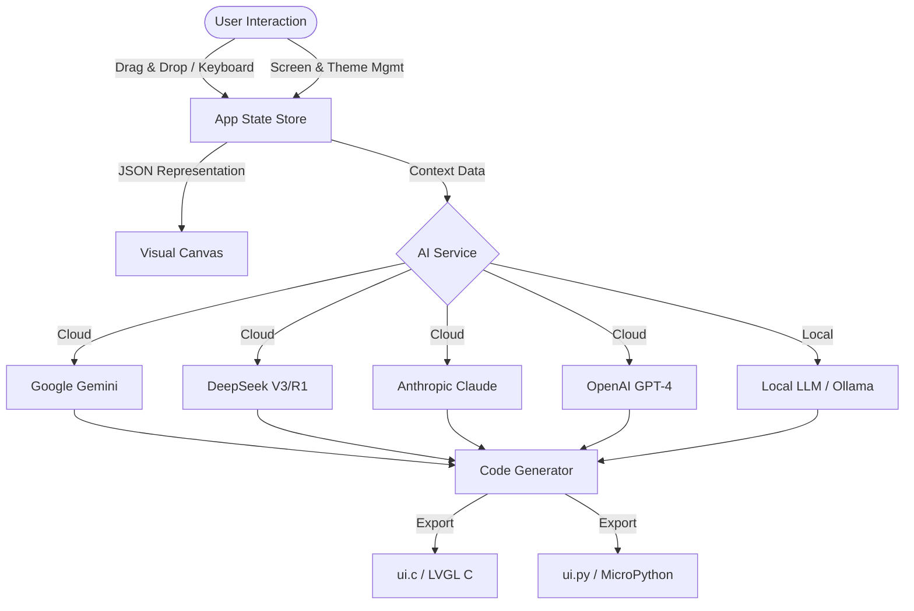

# LVGL Studio AI 🎨✨

**LVGL Studio AI** is a professional, browser-based visual interface designer for embedded systems. It empowers developers to visually build complex **Multi-Screen** GUIs for the **Light and Versatile Graphics Library (LVGL)** using a drag-and-drop interface, and instantly generate production-ready C or MicroPython code using **Google's Gemini AI**, **Anthropic Claude**, **OpenAI**, **DeepSeek**, or **Local LLMs**.

  

## 🌟 Key Features

*   **Multi-Screen Support** 🆕: Create, rename, and manage multiple screens. Visually link buttons to navigate between them.
*   **Device Presets** 🆕: Instant canvas resizing for popular hardware including **M5Stack**, **Adafruit**, **Waveshare**, and generic TFT displays.
*   **Global Theming** 🆕: Instantly style your entire project with presets like *Cyberpunk*, *Midnight*, *Retro*, and more.
*   **Event System** 🆕: Define logic for Clicked, Pressed, Released, and Value Changed events. Support for Navigation actions or Custom C/Python code.
*   **Visual Drag-and-Drop Editor**: Intuitive canvas to place and arrange UI elements with snapping.
*   **Layer Management**: Create, lock, hide, and **reorder** layers via drag-and-drop to manage complex composite UIs.
*   **Image Uploads**: Upload images to preview them on the canvas and generate correct file-reference code.
*   **Multi-Provider AI**: Generate code using **Gemini (Flash/Pro)**, **DeepSeek V3/R1**, **Claude 3.5**, **GPT-4o**, or local models (Ollama).
*   **Live Properties**: Real-time editing of dimensions, colors, borders, shadows, and logic.

---

## 🚀 Running Locally

To run the application locally, you need **Node.js** installed.

### Steps

1.  **Clone the repository**.
    ```bash
    git clone https://github.com/yourusername/lvgl-studio-ai.git
    cd lvgl-studio-ai
    ```

2.  **Install Dependencies**:
    ```bash
    npm install
    ```

3.  **Start Development Server**:
    ```bash
    npm run dev
    ```

4.  **Open in Browser**:
    Navigate to `http://localhost:5173`.

### Environment Variables
To use Gemini API, create a `.env` file in the root directory:
```
API_KEY=your_google_gemini_api_key
```

---

## 📐 Workflow Architecture



---

## 🛠️ User Guide

### 1. The Workspace Layout
The interface is divided into three professional zones:
*   **Left Sidebar**: Widget Palette and Screen List.
*   **Center (Canvas)**: Your active WYSIWYG design area.
*   **Right (Properties)**: Context-aware panel.
    *   *If Widget Selected*: Edit properties, events, and styles.
    *   *If Canvas Selected*: Edit Screen settings, **Target Device**, Global Theme, and **Layers**.

### 2. Multi-Screen & Navigation 🧭
1.  **Add Screen**: Go to the **Screens** tab in the left sidebar and click `+`.
2.  **Switching**: Click a screen name in the list to edit it.
3.  **Linking**: Select a Button or Icon, go to **Properties > Events**, add an event, set Action to `NAVIGATE`, and select the target screen.

### 3. Event Logic ⚡
Widgets support a robust event system. In the **Properties Panel**:
1.  Click **Add Event**.
2.  Select Trigger (e.g., `CLICKED`, `VALUE_CHANGED`).
3.  Select Action:
    *   **NAVIGATE**: Switches screens using `lv_scr_load_anim`.
    *   **CUSTOM CODE**: Injects raw C or Python code (e.g., `printf("Hello");` or `led.on()`).
4.  Widgets with events display a small yellow "Zap" badge on the canvas.

### 4. Image Handling 🖼️
1.  Add an **Image Widget**.
2.  In the Properties Panel, click **Upload Image**.
3.  The image is Base64 encoded for the browser preview.
4.  The generated code will reference the filename (e.g., `lv_img_set_src(ui_img, "S:my_image.png")`).

### 5. AI Configuration ⚙️
Click the **Settings Icon** in the top header to configure your AI provider.
*   **Google Gemini**: Default. Supports **Google AI Studio** account integration (via "Connect Google Account") to access **Gemini 3.0 Pro** and **Thinking** models with higher limits.
*   **DeepSeek**: Enter your API key. Supports **DeepSeek V3** and **R1** (Reasoner).
*   **Anthropic Claude**: Enter your API key to generate high-quality code using **Claude 3.5 Sonnet** or **Opus**.
*   **OpenAI**: Requires `sk-...` key.
*   **Local LLM**: Connect to local endpoints (e.g., Ollama at `http://localhost:11434/v1`).

### 6. AI Code Generation 🤖
1.  Design your UI.
2.  Select your **Target Device** (e.g., M5Stack Core2) in Global Settings for optimized resolution.
3.  Click **Generate Code**.
4.  The AI receives a structured JSON payload describing all screens, widgets, themes, and events.
5.  It produces fully functional C (LVGL v8/v9) or MicroPython code.

---

## 📦 Supported Widgets

| Widget | Icon | Configurable Properties |
| :--- | :---: | :--- |
| **Button** | ⏹️ | Text, Color, Radius, Gradient sheen |
| **Label** | 🔤 | Text content, Font size, Text Color |
| **Slider** | 🎚️ | Value, Range (Min/Max), Indicator Color, Knob style |
| **Switch** | 🔛 | Checked state, Pill styling, Animation timing |
| **Checkbox** | ☑️ | Label text, Checked state |
| **Arc** | ⭕ | Value, Range, Track/Indicator colors, Thickness |
| **Container** | 📦 | Background (Solid/Transparent), Borders, Radius |
| **Text Area** | 📝 | Placeholder, Text, Cursor blink simulation |
| **Chart** | 📊 | Line vs Bar mode, Data points simulation, Grid lines |
| **Image** | 🖼️ | Source path/upload, Placeholder visualization |
| **Icon** | ⭐ | Built-in LVGL Symbols (Home, Wifi, Battery, etc.) |

---

## 📝 License

This project is open-source under the MIT License. Generated code belongs to the user.