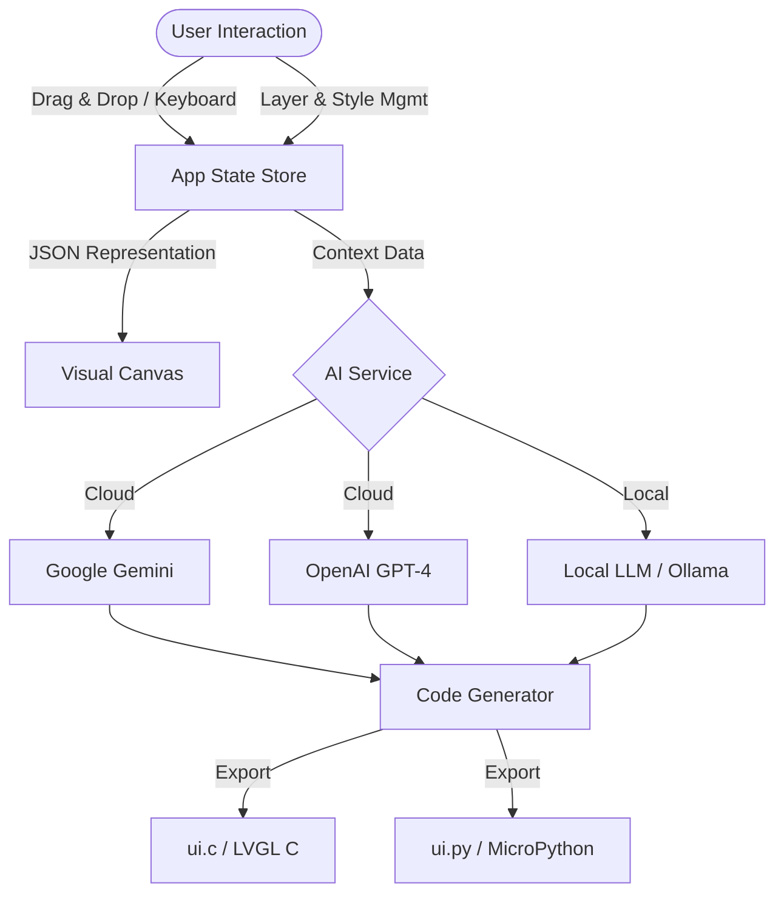

# LVGL Studio AI 🎨✨

**LVGL Studio AI** is a professional, browser-based visual interface designer for embedded systems. It empowers developers to visually build complex GUIs for the **Light and Versatile Graphics Library (LVGL)** using a drag-and-drop interface, advanced layer management, and instantly generate production-ready code using **Google's Gemini AI**, **OpenAI**, or **Local LLMs**.

  

## 🌟 Key Features

*   **Visual Drag-and-Drop Editor**: Intuitive canvas to place and arrange UI elements with snapping.
*   **Layer Management**: Create, lock, hide, and reorder layers to manage complex composite UIs.
*   **Precision Control**: Keyboard navigation for pixel-perfect widget positioning.
*   **Grouping & Alignment**: Group widgets to move them together and control Z-index ordering (Bring to Front/Back).
*   **Style Presets**: Save and re-use your favorite widget styles (Glassmorphism, Cyber, Neumorphism, etc.).
*   **Multi-Provider AI**: Generate code using Gemini, OpenAI, or local models (Ollama/LocalAI).
*   **Live Properties**: Real-time editing of dimensions, colors, borders, shadows, and logic.

---

## 📐 Workflow Architecture



---

## 🛠️ User Guide

### 1. The Workspace Layout
The interface is divided into three professional zones:
*   **Left Sidebar (Palette & Layers)**: Toggle between adding **Widgets** and managing **Layers**.
*   **Center (Canvas)**: Your active WYSIWYG design area.
*   **Right (Properties)**: Context-aware panel for editing specific settings, global canvas options, or selection groups.

### 2. AI Configuration ⚙️
Click the **Settings Icon** in the top header to configure your AI provider.

#### Google Gemini (Default)
*   **API Key**: Uses `process.env.API_KEY` by default. You can override this in the settings dialog.
*   **Model**: Defaults to `gemini-2.5-flash` for high speed and low latency.

#### OpenAI
*   **API Key**: Required (`sk-...`).
*   **Model**: Defaults to `gpt-4o`.

#### Custom / Local LLM (e.g., Ollama, LocalAI)
Perfect for offline development or privacy-centric workflows.
*   **Base URL**: Point to your local server (e.g., `http://localhost:11434/v1`).
*   **Model**: The name of the model loaded in your local instance (e.g., `llama3`, `mistral`, `codellama`).
*   **Note**: Ensure your local server supports CORS if running from a browser.

### 3. Layer Management 🍰
Complex UIs require organization. Use the **Layers** tab in the left sidebar to:
*   **Add Layers**: Click `+` to create new transparent layers on top of the base.
*   **Locking 🔒**: Click the lock icon to prevent accidental edits to background elements.
*   **Visibility 👁️**: Toggle visibility to focus on specific parts of the UI. Hidden layers are excluded from code generation.
*   **Selection**: Clicking a layer name makes it the "Active Layer". New widgets are always added to the Active Layer.

### 4. Widget Operations
*   **Placement**: Drag from the palette or click to add to the center.
*   **Grouping**: Select multiple items (hold Shift + Click) and press **Group** in the right panel.
*   **Z-Index**: Use the "Bring Forward", "Send Backward", "Front", and "Back" buttons to arrange overlapping items.
*   **Resizing**: Use the drag handles on selected widgets (supports aspect-ratio locking for Icons/Images).

### 5. Keyboard Shortcuts ⌨️
Achieve pixel-perfect precision without touching the mouse:

| Shortcut | Action | Description |
| :--- | :--- | :--- |
| **Arrow Keys** | Nudge Position | Move selected widget(s) by **1px**. |
| **Shift + Arrow** | Fast Move | Move selected widget(s) by **10px**. |
| **Shift + Click** | Multi-Select | Add/Remove widget from selection. |
| **Delete** | Delete | Remove selected widgets. |

### 6. AI Code Generation 🤖
1.  Design your UI.
2.  Click the **Generate Code** button in the top header.
3.  Choose **C (LVGL)** or **MicroPython**.
4.  The AI analyzes your layers, groups, and styles to produce specific code including:
    *   Object creation (`lv_btn_create`, `lv_label_create`, etc.).
    *   Style definitions (`lv_style_t`).
    *   Positioning and sizing.
    *   Event handler skeletons.

---

## 📦 Supported Widgets

| Widget | Icon | Configurable Properties |
| :--- | :---: | :--- |
| **Button** | ⏹️ | Text, Color, Radius, Gradient sheen |
| **Label** | 🔤 | Text content, Font size, Text Color |
| **Slider** | 🎚️ | Value, Range (Min/Max), Indicator Color, Knob style |
| **Switch** | 🔛 | Checked state, Pill styling, Animation timing |
| **Checkbox** | ☑️ | Label text, Checked state |
| **Arc** | ⭕ | Value, Range, Track/Indicator colors, Thickness |
| **Container** | 📦 | Background (Solid/Transparent), Borders, Radius |
| **Text Area** | 📝 | Placeholder, Text, Cursor blink simulation |
| **Chart** | 📊 | Line vs Bar mode, Data points simulation, Grid lines |
| **Image** | 🖼️ | Source path, Placeholder visualization |
| **Icon** | ⭐ | Built-in LVGL Symbols (Home, Wifi, Battery, etc.) |

---

## 🔧 Setup & Configuration

This project is built with **React 19**, **TailwindCSS**, and **Google GenAI SDK**.

1.  **API Key**: Ensure `process.env.API_KEY` is set in your environment variables or build configuration.
2.  **Dependencies**: The app uses ES Modules (ESM) via `importmap` for a build-free experience in the browser, but can be bundled.

```json
// metadata.json configuration
{
  "name": "LVGL Studio AI",
  "permissions": []
}
```

## 📝 License

This project is open-source under the MIT License. Generated code belongs to the user.
